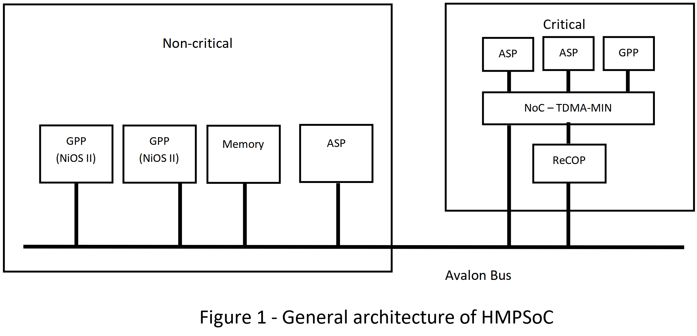

# HMPSoC Application
Application developed in psudo-system GALS language

HMPSoC Execution Platform
* Multi-core system
	* Mixed-criticality
* Communication via NoC

## Objective
- Create ReCOP design (multi-cycle) with custom interfaces
- Interface DP-ASP from IRP and ReCOP over NoC (TDMA-MIN)
- Replace function of I/O-ASP with ReCOP

### Component Elements
- Processor Cores
	- ReCOP, time-predictable processor (critical)
	- Nios II, general purpose processor (non-critical)
- ASP
- Interconnections
	- Avalon Bus - Multiple components on single bus
	- TDMA-MIN NoC - Time predictable, bounded latency access

## Design

### Control Driven Part (ReCOP)
- Synchronyously reactive control flow

### Data Driven Part (ASP)
- Processing of data at high data rates

### ASP
**Requirements:**
- Reactivity to inputs and events  (i.e I/O)
- Processing data stream -> output stream
- Supports non-critical functions

ASPs will operate on streaming samples of data, perform computations over an  
internal buffer implemented in local memory, and output data as appropriate

**IO-ASP (ADC-ASP, DAC-ASP)**
- Input (emulating ADC)
	- Virtual Channels
	- Sampling Rates
- Output (emulating DAC)
	- Anologue Output

**DP-ASP**
- Direct passthrough  
- Linear filtering  
- Averaging (rolling)  
- Peak Detection

## Implementation
**Application:** Signal Analysis System

- SysytemGALS
	- C Host Language
	- Tools not developed? *Manualy develop applications and generate particial executables???**

### Behaviour
1) Runtime configuration from board switches
	1) Select input channel
	2) Select Sampling rate
	3) Selects ASP pipeline in (any) combination
		- Direct passthrough  
		- Linear filtering  
		- Averaging (rolling) 
		- Peak Detection
		- ADC
		- DAC
2) Perform the configured operations from ReCOP
3) System Outputs:
	1) Reflect system state through LEDs
	2) Output processed anologue signal to a pin (measured with oscillascope)

**Example Behaviour:**
- Config:
	- As an example, to configure linear filter mode the ReCOP would send a DAC-ASP configure command to enable the appropriate DAC output, then a Data Processing ASP (DP-ASP) command to configure it to execute a linear filter over the provided data with the DAC as an output destination, then finally an ADC-ASP configuration command to select the ADC channel, sample rate, and set the output destination to the DP-ASP. 
- Processing:
	- At this point the ADC-ASP will begin sending data to the DP-ASP, then the DP-ASP will perform the linear filtering function and (when data is available) this will send the data to the DAC-ASP. Similarly, you can create different datapaths that process the data stream in cascade that comprises different processing blocks (DP-ASPs)

As an example, one configuration might involve three DP-ASPs, where ADC channel 1 being passed through a linear filter, then to peak detection, with the peak detection output to the DAC channels, leading to the following configuration:  

1. The DP-ASP used for peak detection should be configured to peak detect mode, with output set to the DAC-ASP address  
2. The DP-ASP used for linear filtering should be configured to linear filter mode, with the output set to the DP-ASP used for peak detection  
3. The ADC-ASP should be configured with the desired channel to output to the ASP performing linear filtering

Once this configuration is complete, the ADC-DSP will periodically output data which will autonomously be passed through the required pipeline of DP-ASPs to the DAC-ASP. Prior to reconfiguration, the ADC-DSP should be deactivated to avoid spurious data travelling through the datapath.

### Specs
- 1 ReCOP
- 3 ASPs
- TDMA-MIN (8 ports, one to extend connectivity to Avalon Bus, the non-critical part of system)
- Message (configuration and data)
	- 32-bits operations
Data Formats
	- Fixed point or integer
	- NO DIVIDERS NEEDED

# To Dos:
**Logistics:**
- GitHub
- GDrive
- Miro

### Prerequisites Paradimes
- **State Machine ASP (Control Paradime of ReCOP)**
	- Sends config messages for indivisual developement of ASP
- **NoC Message protocols and format**
	- What is our message format?

**What is the purpose of our Nios II?**
- LED and Switch Handling
- Software linkage to commands -> (Becomes reconfigurable and easy to extend with additional DP-ASP)

**What is the purpose of our ReCOP?**
- Doe it has its own software?

**Big Questions:**
- So, communication between Nios II and ReCOP over:
	- Avalon?
	- TDMA-MIN?

## Partitionable Work
### ASP Pipeline
**Aim:** Implement nodes to interact with NoC and do work on data
- Decide what type of filters our DP-ASP do.
	- Do we develop multi-function ASPs (modes)?
- Decided on the necessary interaction our IO-APS do.\
	- Interfaces:
		- **Unilateral info-passing** - Dp-ASP only receives infomation and forwards address
			- NEVER sends infomation to itself OR returns infomation to source!!!
	- Valid Infohandling (config & data)
- How to interface with ADC-ASP and DAC-ASP?
	- As per Assignment 2?

**Jobs**
- IP Block Synthesis Functions
- Direct passthrough  
- Linear filtering  
- Averaging  
- Peak Detection

### ReCOP - ?? What to do?
**Aim:** Customise ReCOP (add or remove) for our application
- What should be our size of registers, data memory?
- Do we want extra registers for return values? DPCR address?
- What is our meaning of DPRR?
- What are our RECOP commands to NoC?
	- DP (port 4-7) config messages
	- ADC/DAC (port 2, 3) config messages

**Jobs**
- Build interface to NoC
- Build Program loader node (direct access to PM)
- Data modules as C functions

### Nios
- Switches, Led interface...
- Avalon Bus
- Communicates with ReCOP?

### HMPSoC System
- ASP as IP components
- How to link? Develop with System J?

## To Ask:
Is this recorded?

**Major Gaps in Workflow:**
- ReCOP Assembler? What are the aspects of ReCOP we have to develope in software?
	- *"software developed using SystemGALS style specifications; those specifications will be manually mapped on software in C and ReCOP assembly language"*
- SystemJ developement?

**Check:**
- Nio II will require the on-chip SRAM, SDRAM and FLASH. The ReCOP utilises M4K RAM blocks for its program and data memory.
	- Are each of these memories reserved for Nios II? Can we and should we interface with it directly (bypassing Nios II and/or ReCOP)?

- **As specified in the IRP brief in relation to our GRP:** 
	- Is it a requirement that our IRP must be able to operate on both arrays through direct memory access and streamed data from ASP? the ASP need to directly interface with memory.
		- Where would this data be if stored in memory?
		- The loading of data, we have some options: 
			- Send data packages like assignment two. 
			- Send address and the DP perform DMA.
				- Through TDMA-MIN ports or ReCOP.
	- Since the mentioned example described 24-bit word signed integer as the data... Is this a specification for our project or a suggestion? We only have access to 16-bit or 32-bit bus line in for example, the SDRAM. This will impact how we plan to store these data in memory (in 32-bit alignments) and our message format.
	- Specification wise, is our IRP DP must be multi-functional? How many? Yes, we will have to send config message for various parameters, but distinctly different functions.
		- ADC/DAC-ASP is part of GRP?

**Pipelining Logic:**
		- **Unilateral info-passing** - Dp-ASP only receives infomation and forwards address
			- NEVER sends infomation to itself OR returns infomation to source!!!

**GRP:**
- Where do custom instructions fit in our HMPSoC design?
- What is the interaction between Nios II and ReCOP? 
	- Nios II - handles human-computer interface and commands ReCOP to perform configuration and pipelining.e
		- Logic is encased in Nios II software, the commands to ReCOP simply executes these commands.
- We assume the interaction between ReCOP and DP are only configurations. The DP will be configured to run in some order on the data from the ADC-ASP. But never reports to ReCOP.

**ReCOP:**
- What is our external enviroment? Do we have any uses for SOP and SIP?
- What is `we` in the memory interface of ReCOP?
- Where should we place our what avanue (TDMA-MIN or ReCOP or Avalon) should we perform DMA from?
- What should be our FIFO buffer be with the DP(s)?